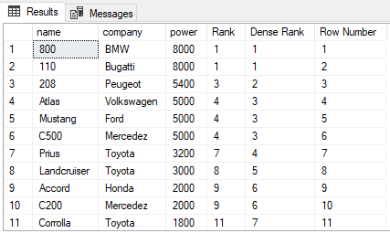

# SQL Window Functions Tutorial

This repository provides a hands-on tutorial for understanding and using SQL window functions. It includes sample data, table creation scripts, and a variety of queries that demonstrate the power and flexibility of window functions in SQL.

This repository is designed for data analysts, data scientists, and database developers who want to learn how to use window functions to perform complex data analysis tasks more efficiently.

## Getting Started

To get started with this tutorial, you will need a SQL environment (like SQL Server, PostgreSQL, MySQL, etc.) where you can execute the provided scripts.

1.  **Create the Employee Table:**
    Open the `Windows_Function/Employee_Table.sql` file. This script contains the `CREATE TABLE` statement for the `Employee` table and the `INSERT` statements to populate it with sample data. Execute this script in your SQL environment to create and populate the table.

2.  **Explore the Window Function Queries:**
    The `Windows_Function/Windows_Function-1.sql` file contains a series of SQL queries that demonstrate different window functions. You can run these queries one by one to see how they work.

## Window Functions Covered

This tutorial covers the following window functions:

*   **Aggregate Functions as Window Functions:**
    *   `MAX()`: Used to find the maximum value within a partition.
*   **Ranking Functions:**
    *   `ROW_NUMBER()`: Assigns a unique, sequential integer to each row within a partition.
    *   `RANK()`: Assigns a rank to each row within a partition based on an ordered set of values. Ranks may not be consecutive if there are ties.
    *   `DENSE_RANK()`: Similar to `RANK()`, but ranks are consecutive, even if there are ties.
*   **Offset Functions:**
    *   `LAG()`: Provides access to a row at a given physical offset that comes before the current row.
    *   `LEAD()`: Provides access to a row at a given physical offset that comes after the current row.

## Visual Comparison of Ranking Functions

The following image illustrates the difference between `ROW_NUMBER()`, `RANK()`, and `DENSE_RANK()`:

